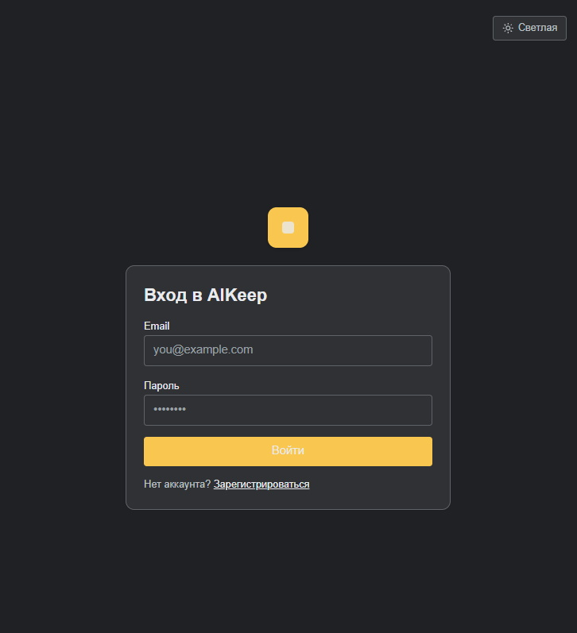
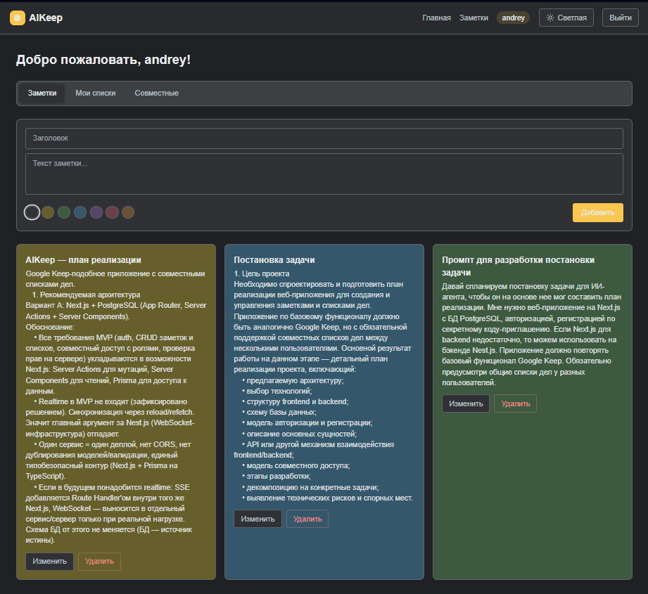
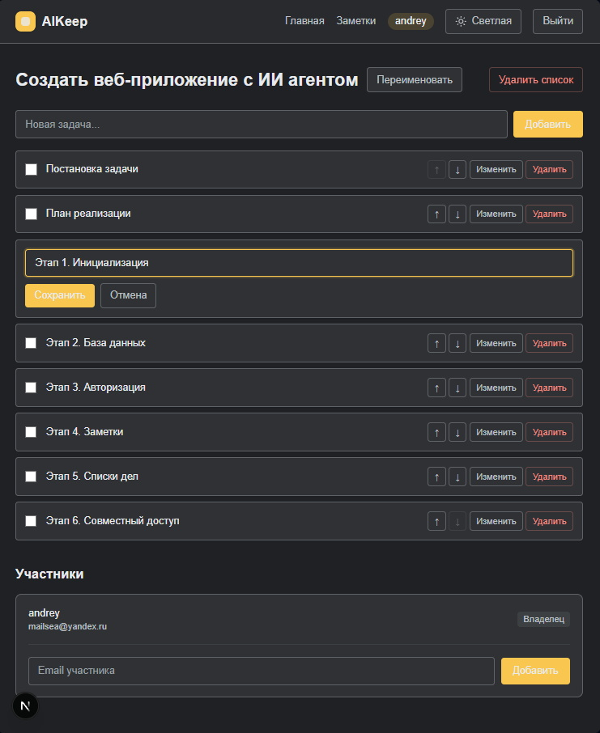

# AIKeep

AIKeep — это полнофункциональное приложение для заметок в стиле Google Keep с поддержкой **совместных списков задач**. Приложение полностью создано искусственным интеллектом в [OpenCode](https://opencode.ai) на базе модели **DeepSeek V4 Flash** — от архитектуры и бизнес-логики до интерфейса и документации.

## Что это за приложение

AIKeep сочетает в себе два ключевых инструмента для организации личной и командной работы:

- **Заметки** — личные, приватные для каждого пользователя. Можно задать заголовок, текст и цвет (палитра из 7 цветов). Заметки поддерживают мягкое удаление (подготовка к будущей «корзине»), а схема данных уже включает флаги закрепления и архивации.
- **Совместные списки задач** — пользователь создаёт список, а владелец может приглашать участников по email. Участники получают права **редактора** и могут добавлять, отмечать, редактировать, удалять и перемещать пункты. Списки отображаются во вкладках «Мои списки» и «Совместные».

Приложение работает на русском языке и построено по принципу **регистрации по приглашению**: без действующего инвайт-кода зарегистрироваться нельзя.

## Основной функционал

**Аутентификация**
- Регистрация с обязательным инвайт-кодом, вход и выход из аккаунта.
- Хеширование паролей Argon2id, HTTP-only cookie-сессии на 30 дней со скользящим продлением.
- Атомарное (без гонок) расходование инвайт-кодов в рамках транзакции.

**Заметки**
- Создание, редактирование и удаление заметок.
- Настраиваемая палитра из 7 цветов (белый, жёлтый, зелёный, синий, фиолетовый, розовый, оранжевый).
- Мягкое удаление (`deletedAt`) — фундамент для будущей корзины.

**Списки задач**
- Создание списков, добавление и редактирование пунктов.
- Отметка «выполнено», перемещение пунктов вверх/вниз, удаление.
- Переупорядочивание в рамках одной транзакции с валидацией целостности порядка.

**Совместная работа**
- Владелец списка приглашает участников по точному email, меняет их роли и исключает из списка.
- Роли: `OWNER` (владелец), `EDITOR` (редактор), `VIEWER` (зритель).
- Только владелец видит email участников; остальным показываются только имена.

**Администрирование**
- Панель `/admin/invites` для управления инвайт-кодами (доступна только ADMIN).
- Создание кода вручную или автогенерация из недвусмысленного алфавита.
- Лимит использований, срок действия, активация/деактивация, удаление, счётчик использований.

**Интерфейс**
- Дашборд с вкладками «Заметки» / «Мои списки» / «Совместные».
- Тост-уведомления об ошибках и успехе операций.
- Адаптивный интерфейс в стиле Google Keep на Tailwind CSS v4.

**Скриншоты**







## Технологический стек

| Слой | Технология |
|---|---|
| Фреймворк | Next.js 16 (App Router, Server Actions) |
| Язык | TypeScript 5 (strict) |
| UI | React 19, Tailwind CSS v4, Geist |
| База данных | PostgreSQL 16 |
| ORM | Prisma 6 (миграции `prisma migrate`) |
| Валидация | Zod 4 |
| Хеширование паролей | Argon2id (`@node-rs/argon2`) |
| Сессии | DB-сессии + SHA-256 хеш токена в HTTP-only cookie |
| Тесты | Vitest 3 (юнит-тесты) |
| Линтинг | ESLint 9 (`eslint-config-next`) |
| Инфраструктура | Docker Compose для локального Postgres |

## Архитектура

Проект следует чистому разделению бизнес-логики и UI:

- **`src/server/`** — вся бизнес-логика: аутентификация, заметки, списки, участники, инвайты, проверки прав доступа, Zod-схемы. Здесь **нет ни одного импорта из Next.js**, что делает сервисы полностью тестируемыми.
- **`src/actions/`** — тонкие Server Actions-адаптеры: проверка аутентификации → валидация → вызов сервиса → `revalidatePath` / `redirect`.
- **`src/app/`** — страницы и роуты: группа `(auth)` (вход/регистрация), группа `(main)` (дашборд и списки) и `admin` (инвайт-коды).
- **`src/components/`** — React-компоненты: формы с `useActionState`, тосты через ToastProvider, сетка заметок, панели списков и участников.
- **`src/lib/`** — Prisma-синглтон, помощники аутентификации, модель ошибок (`AppError` / `ApiError`).

Права доступа проверяются на двух уровнях: на уровне роутов (redirect) и повторно в каждом сервисе (403). Модель владения списком построена на записи `TodoListMember` с ролью `OWNER` — без отдельного поля `ownerId`.

## Как развернуть

### Требования

- Node.js 20+ и npm
- PostgreSQL 16 (или Docker)

### 1. Клонирование и установка

```bash
git clone <url-репозитория> AIKeep
cd AIKeep
npm install
```

### 2. Запуск базы данных

Проще всего поднять Postgres через Docker Compose:

```bash
docker compose up -d
```

### 3. Настройка окружения

Скопируйте `.env.example` в `.env` и при необходимости отредактируйте:

```bash
copy .env.example .env
```

Основные переменные:

| Переменная | Описание |
|---|---|
| `DATABASE_URL` | Строка подключения к PostgreSQL |
| `TEST_DATABASE_URL` | Отдельная БД для юнит-тестов (vitest) |
| `ADMIN_EMAIL` | Email администратора (для seed) |
| `ADMIN_PASSWORD` | Пароль администратора (для seed) |
| `ADMIN_DISPLAY_NAME` | Имя администратора |
| `INVITE_CODE` | Инвайт-код для регистрации (для seed) |
| `INVITE_MAX_USES` | Максимум использований инвайт-кода (пусто = без лимита) |

### 4. Миграции и сид

```bash
npm run db:migrate    # применение миграций в dev-режиме
npm run db:seed       # создание админа и инвайт-кода из .env
```

### 5. Запуск приложения

```bash
npm run dev           # http://localhost:3000
```

Войдите под администратором (`ADMIN_EMAIL` / `ADMIN_PASSWORD`) или зарегистрируйтесь по инвайт-коду.

## Скрипты

| Команда | Назначение |
|---|---|
| `npm run dev` | Запуск dev-сервера |
| `npm run build` | Продакшен-сборка |
| `npm run start` | Запуск продакшен-сборки |
| `npm run lint` | Линтинг (ESLint) |
| `npm run typecheck` | Проверка типов (tsc --noEmit) |
| `npm test` | Юнит-тесты (Vitest) |
| `npm run db:migrate` | Создание миграции |
| `npm run db:deploy` | Применение миграций в проде |
| `npm run db:seed` | Сид базы (админ + инвайт-код) |
| `npm run db:studio` | Prisma Studio |

## Тестирование

Юнит-тесты покрывают хеширование паролей, сессии, атомарное расходование инвайт-кодов и сервис регистрации (включая конкурентный сценарий из 10 параллельных регистраций):

```bash
npm test
```

## Деплой

Приложение рассчитано на деплой на Vercel с управляемой базой данных (Neon/Supabase) и продакшен-миграциями:

```bash
npm run db:deploy     # применить миграции на продакшен-БД
npm run build         # собрать приложение
```

## Статус и планы

MVP реализован полностью. В планах: корзина заметок, rate-limiting на вход/регистрацию, drag-and-drop переупорядочивание, Playwright e2e-тесты и CI-пайплайн.